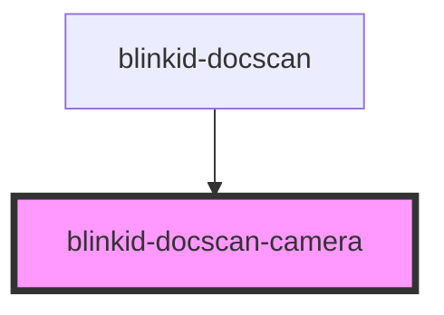

# blinkid-hidden

<!-- Auto Generated Below -->

## Properties

| Property              | Attribute | Description | Type                         | Default     |
| --------------------- | --------- | ----------- | ---------------------------- | ----------- |
| `config` _(required)_ | --        |             | `BlinkIdDocScanCameraConfig` | `undefined` |

## Methods

### `startScan() => Promise<void>`

#### Returns

Type: `Promise<void>`

## Dependencies

### Used by

 - [blinkid-docscan](../blinkid-docscan)

### Graph

----------------------------------------------

*Built with [StencilJS](https://stenciljs.com/)*
