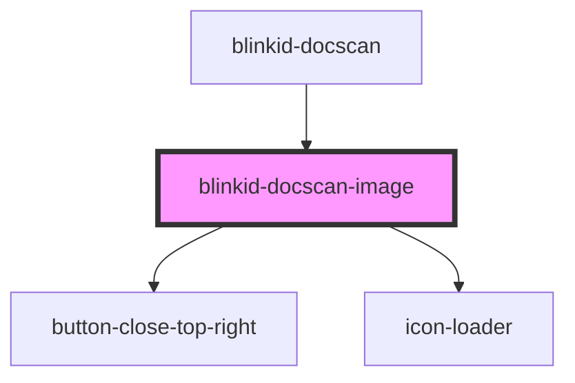

# blinkid-docscan-image

<!-- Auto Generated Below -->

## Properties

| Property | Attribute | Description | Type                        | Default     |
| -------- | --------- | ----------- | --------------------------- | ----------- |
| `config` | --        |             | `BlinkIdDocScanImageConfig` | `undefined` |

## Methods

### `startScan() => Promise<void>`

#### Returns

Type: `Promise<void>`

## Dependencies

### Used by

 - [blinkid-docscan](../blinkid-docscan)

### Depends on

- [button-close-top-right](../button-close-top-right)
- [icon-loader](../icon-loader)

### Graph

----------------------------------------------

*Built with [StencilJS](https://stenciljs.com/)*
