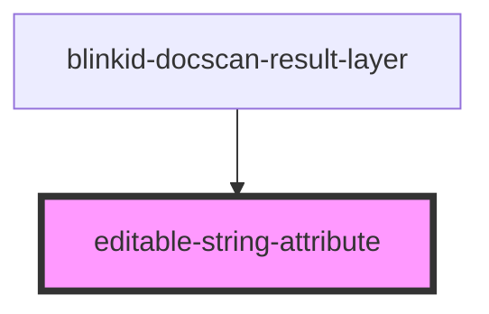

# blinkid-result-layer

<!-- Auto Generated Below -->

## Properties

| Property              | Attribute | Description | Type                            | Default     |
| --------------------- | --------- | ----------- | ------------------------------- | ----------- |
| `config` _(required)_ | --        |             | `EditableStringAttributeConfig` | `undefined` |
| `value` _(required)_  | `value`   |             | `string`                        | `undefined` |

## Dependencies

### Used by

 - [blinkid-docscan-result-layer](.)

### Graph

----------------------------------------------

*Built with [StencilJS](https://stenciljs.com/)*
