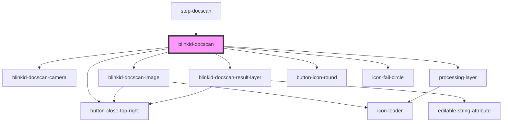

# blinkid-docscan

<!-- Auto Generated Below -->

## Properties

| Property              | Attribute   | Description | Type                   | Default             |
| --------------------- | ----------- | ----------- | ---------------------- | ------------------- |
| `config` _(required)_ | --          |             | `BlinkIdDocScanConfig` | `undefined`         |
| `hasLobby`            | `has-lobby` |             | `boolean`              | `HAS_LOBBY_DEFAULT` |

## Methods

### `reset() => Promise<void>`

#### Returns

Type: `Promise<void>`

### `reviewScan() => Promise<void>`

#### Returns

Type: `Promise<void>`

### `startScan(skipLobby?: boolean) => Promise<void>`

#### Returns

Type: `Promise<void>`

## Dependencies

### Used by

 - [step-docscan](../step-docscan)

### Depends on

- [button-close-top-right](../button-close-top-right)
- [blinkid-docscan-camera](../blinkid-docscan-camera)
- [blinkid-docscan-image](../blinkid-docscan-image)
- [blinkid-docscan-result-layer](../blinkid-docscan-result-layer)
- [processing-layer](../processing-layer)
- [button-icon-round](../button-icon-round)
- [icon-fail-circle](../icon-fail-circle)

### Graph

----------------------------------------------

*Built with [StencilJS](https://stenciljs.com/)*
