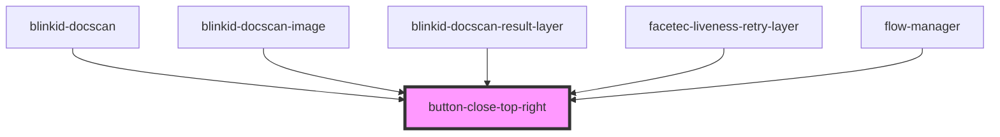

# button-close-top-right

<!-- Auto Generated Below -->

## Properties

| Property     | Attribute     | Description | Type                           | Default     |
| ------------ | ------------- | ----------- | ------------------------------ | ----------- |
| `callbacks`  | --            |             | `ButtonCloseTopRightCallbacks` | `undefined` |
| `isDisabled` | `is-disabled` |             | `boolean`                      | `false`     |
| `size`       | `size`        |             | `string`                       | `'24px'`    |

## Dependencies

### Used by

 - [blinkid-docscan](../blinkid-docscan)
 - [blinkid-docscan-image](../blinkid-docscan-image)
 - [blinkid-docscan-result-layer](../blinkid-docscan-result-layer)
 - [facetec-liveness-retry-layer](../facetec-liveness-retry-layer)
 - [flow-manager](../flow-manager)

### Graph

----------------------------------------------

*Built with [StencilJS](https://stenciljs.com/)*
