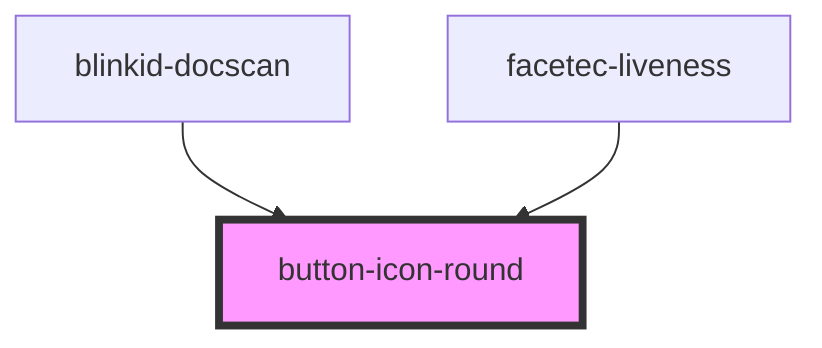

# button-icon-round

<!-- Auto Generated Below -->

## Properties

| Property            | Attribute       | Description | Type                                    | Default     |
| ------------------- | --------------- | ----------- | --------------------------------------- | ----------- |
| `callbacks`         | --              |             | `ButtonIconRoundCallbacks`              | `undefined` |
| `icon` _(required)_ | `icon`          |             | `ButtonIcon.Camera \| ButtonIcon.Image` | `undefined` |
| `isDisabled`        | `is-disabled`   |             | `boolean`                               | `false`     |
| `marginBottom`      | `margin-bottom` |             | `string`                                | `'0px'`     |
| `marginLeft`        | `margin-left`   |             | `string`                                | `'0px'`     |
| `marginRight`       | `margin-right`  |             | `string`                                | `'0px'`     |
| `marginTop`         | `margin-top`    |             | `string`                                | `'0px'`     |
| `size`              | `size`          |             | `number`                                | `36`        |

## Dependencies

### Used by

 - [blinkid-docscan](../blinkid-docscan)
 - [facetec-liveness](../facetec-liveness)

### Graph

----------------------------------------------

*Built with [StencilJS](https://stenciljs.com/)*
