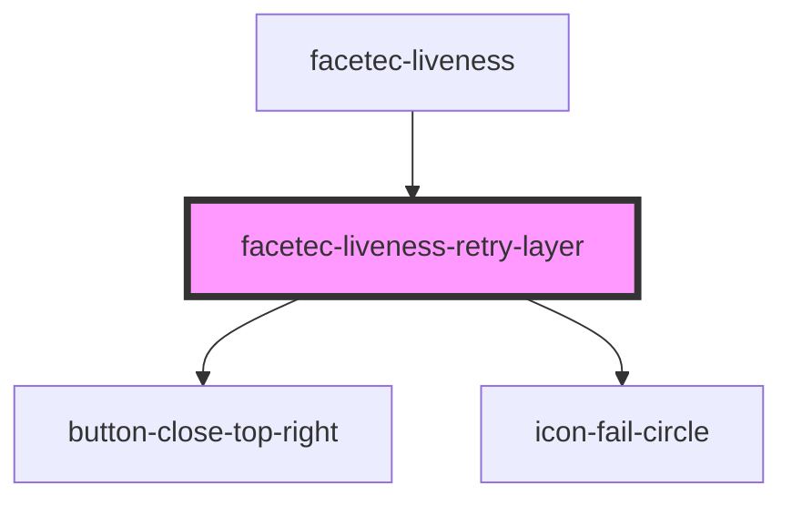

# facetec-retry-layer

<!-- Auto Generated Below -->

## Properties

| Property            | Attribute    | Description | Type                                                                                                                                                                                                                                                                                                                | Default     |
| ------------------- | ------------ | ----------- | ------------------------------------------------------------------------------------------------------------------------------------------------------------------------------------------------------------------------------------------------------------------------------------------------------------------- | ----------- |
| `errorCode`         | `error-code` |             | `Result.CAMERA_ERROR \| Result.CANCELED_BY_USER \| Result.CONFIG_KEYS_ERROR \| Result.CONTEXT_SWITCH \| Result.GRACE_PERIOD_EXCEEDED \| Result.LOCKED_OUT \| Result.NETWORK_ERROR \| Result.NOT_VERIFIED \| Result.ONLY_PORTRAIT_MODE_ALLOWED \| Result.SESSION_TIMEOUT \| Result.UNKNOWN_ERROR \| Result.VERIFIED` | `undefined` |
| `show` _(required)_ | `show`       |             | `boolean`                                                                                                                                                                                                                                                                                                           | `undefined` |

## Events

| Event | Description | Type               |
| ----- | ----------- | ------------------ |
| `no`  |             | `CustomEvent<any>` |
| `yes` |             | `CustomEvent<any>` |

## Dependencies

### Used by

 - [facetec-liveness](../facetec-liveness)

### Depends on

- [button-close-top-right](../button-close-top-right)
- [icon-fail-circle](../icon-fail-circle)

### Graph

----------------------------------------------

*Built with [StencilJS](https://stenciljs.com/)*
