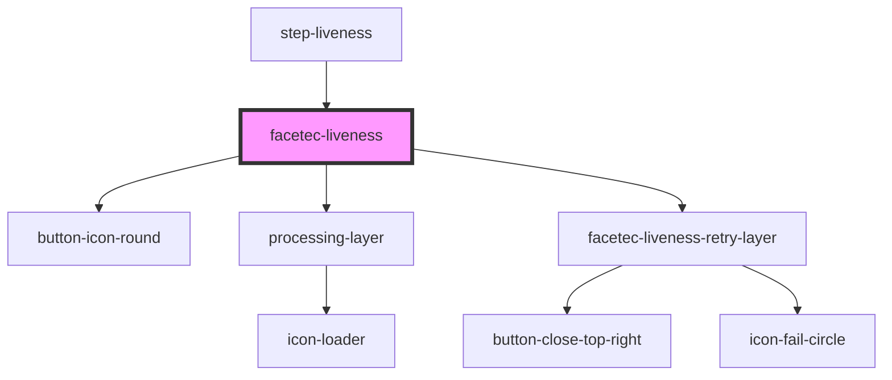

# facetec-hidden

<!-- Auto Generated Below -->

## Properties

| Property              | Attribute   | Description | Type                 | Default             |
| --------------------- | ----------- | ----------- | -------------------- | ------------------- |
| `config` _(required)_ | --          |             | `FaceLivenessConfig` | `undefined`         |
| `hasLobby`            | `has-lobby` |             | `boolean`            | `HAS_LOBBY_DEFAULT` |

## Methods

### `enroll(skipLobby?: boolean) => Promise<void>`

#### Returns

Type: `Promise<void>`

### `reset() => Promise<void>`

#### Returns

Type: `Promise<void>`

## Dependencies

### Used by

 - [step-liveness](../step-liveness)

### Depends on

- [button-icon-round](../button-icon-round)
- [processing-layer](../processing-layer)
- [facetec-liveness-retry-layer](../facetec-liveness-retry-layer)

### Graph

----------------------------------------------

*Built with [StencilJS](https://stenciljs.com/)*
