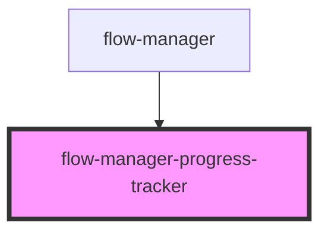

# flow-manager-options

<!-- Auto Generated Below -->

## Properties

| Property                   | Attribute | Description | Type               | Default     |
| -------------------------- | --------- | ----------- | ------------------ | ----------- |
| `checkpoints` _(required)_ | --        |             | `FmptCheckpoint[]` | `undefined` |
| `show` _(required)_        | `show`    |             | `boolean`          | `undefined` |

## Dependencies

### Used by

 - [flow-manager](.)

### Graph

----------------------------------------------

*Built with [StencilJS](https://stenciljs.com/)*
