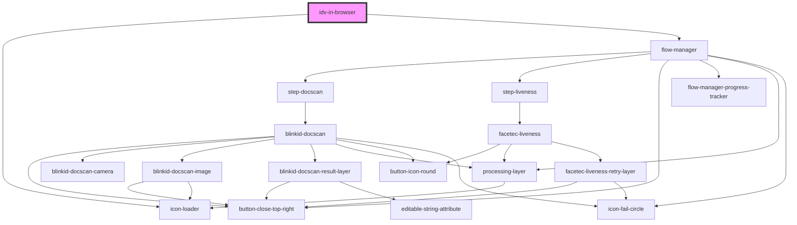

# verify-in-browser

<!-- Auto Generated Below -->

## Properties

| Property | Attribute | Description | Type                 | Default     |
| -------- | --------- | ----------- | -------------------- | ----------- |
| `config` | --        |             | `IdvInBrowserConfig` | `undefined` |

## Events

| Event                 | Description | Type                                                                                                                                                                                                                                                            |
| --------------------- | ----------- | --------------------------------------------------------------------------------------------------------------------------------------------------------------------------------------------------------------------------------------------------------------- |
| `result`              |             | `CustomEvent<IdvInBrowserResult.ERROR \| IdvInBrowserResult.ERROR_BROWSER_SUPPORT \| IdvInBrowserResult.ERROR_CONFIG \| IdvInBrowserResult.ERROR_NETWORK \| IdvInBrowserResult.NEEDS_REVIEW \| IdvInBrowserResult.NOT_VERIFIED \| IdvInBrowserResult.VERIFIED>` |
| `session-initialized` |             | `CustomEvent<string>`                                                                                                                                                                                                                                           |

## Methods

### `restart() => Promise<void>`

#### Returns

Type: `Promise<void>`

## Dependencies

### Depends on

- [icon-loader](../icon-loader)
- [flow-manager](../flow-manager)

### Graph

----------------------------------------------

*Built with [StencilJS](https://stenciljs.com/)*
