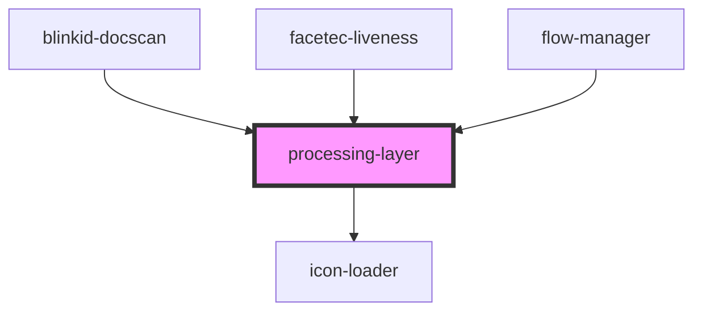

# loading-layer

<!-- Auto Generated Below -->

## Properties

| Property       | Attribute        | Description | Type     | Default                  |
| -------------- | ---------------- | ----------- | -------- | ------------------------ |
| `iconFontSize` | `icon-font-size` |             | `string` | `DEFAULT_ICON_FONT_SIZE` |
| `text`         | `text`           |             | `string` | `DEFUALT_TEXT`           |

## Dependencies

### Used by

 - [blinkid-docscan](../blinkid-docscan)
 - [facetec-liveness](../facetec-liveness)
 - [flow-manager](../flow-manager)

### Depends on

- [icon-loader](../icon-loader)

### Graph

----------------------------------------------

*Built with [StencilJS](https://stenciljs.com/)*
