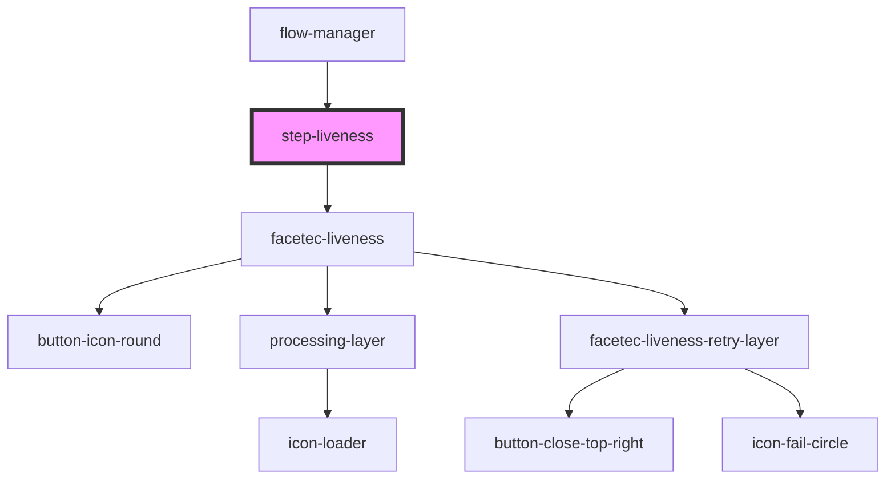

# step-facetec

<!-- Auto Generated Below -->

## Properties

| Property              | Attribute | Description                             | Type                  | Default     |
| --------------------- | --------- | --------------------------------------- | --------------------- | ----------- |
| `config` _(required)_ | --        | Prop()  Mandatory configuration object. | `StepComponentConfig` | `undefined` |

## Methods

### `didSucceed() => Promise<boolean>`

Method()

Checks if step's process finished successfully and a corresponding result data is saved.

#### Returns

Type: `Promise<boolean>`

### `getSuccessData() => Promise<any>`

Method()

Extracts step's sucess result data.

#### Returns

Type: `Promise<any>`

### `reset() => Promise<void>`

Method()

Resets step's state.

#### Returns

Type: `Promise<void>`

### `restart(skipLobby?: boolean) => Promise<void>`

Method()

Resets step's state and starts default process again.

#### Returns

Type: `Promise<void>`

### `start(skipLobby?: boolean) => Promise<void>`

Method()

Starts step's process.
Step is stateful:

A. If it's the first time it is being run then default process is being executed.

B. If it has been run before and it succeeded then step is started in a so-called review mode.

#### Returns

Type: `Promise<void>`

## Dependencies

### Used by

 - [flow-manager](../flow-manager)

### Depends on

- [facetec-liveness](../facetec-liveness)

### Graph

----------------------------------------------

*Built with [StencilJS](https://stenciljs.com/)*
